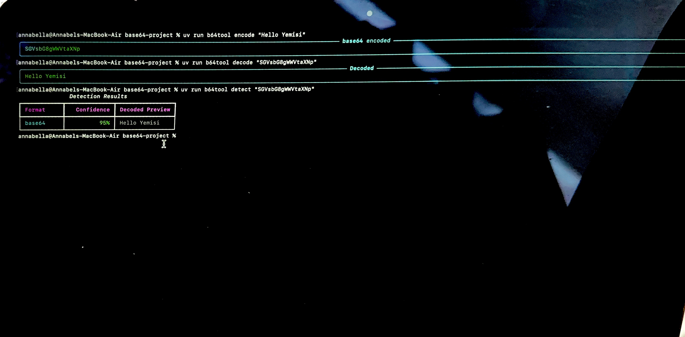
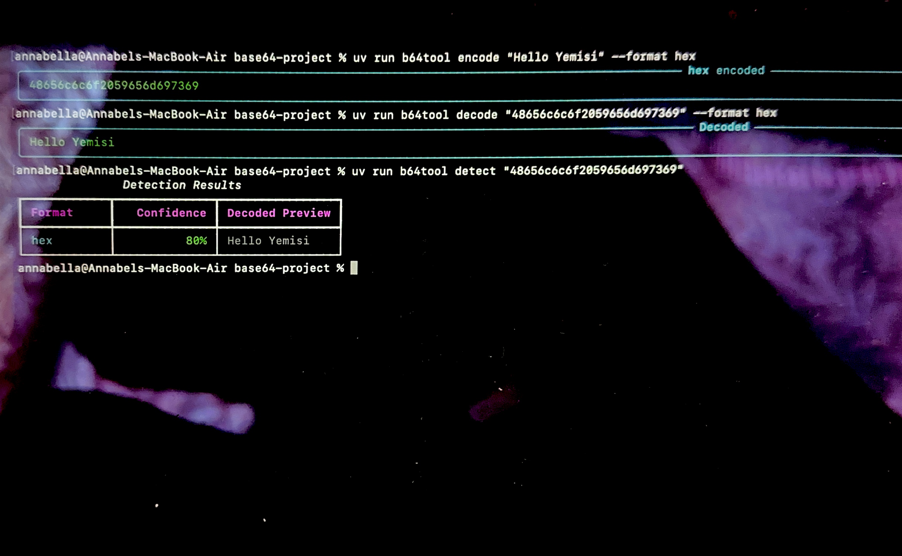
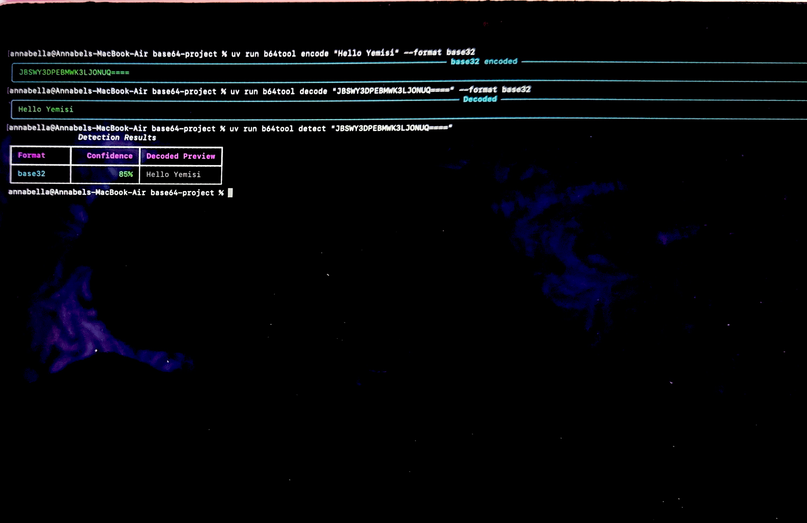
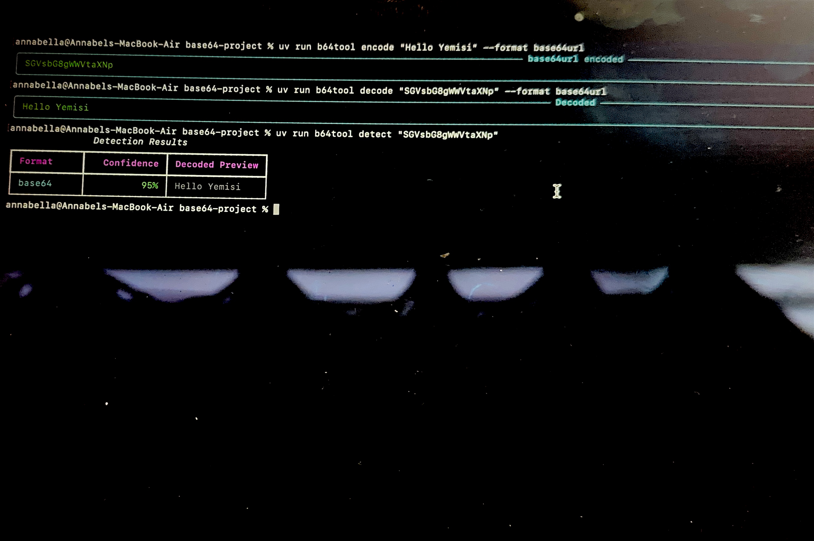
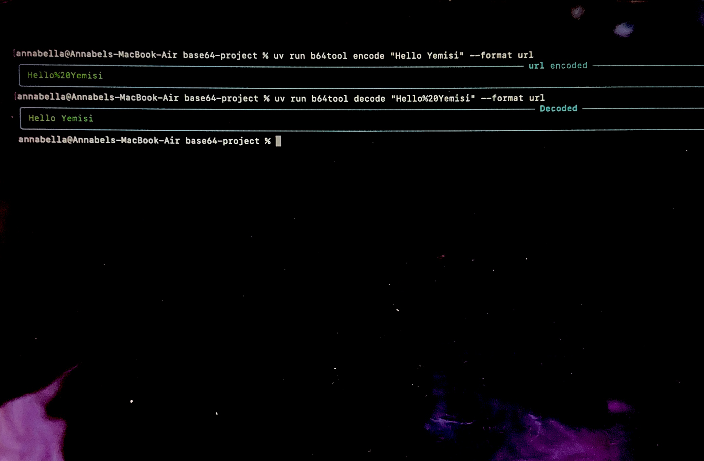
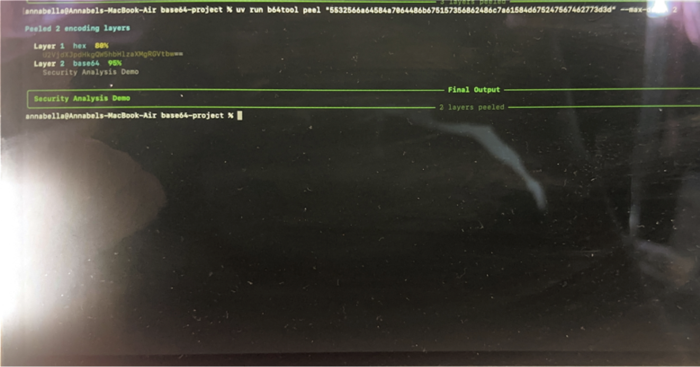
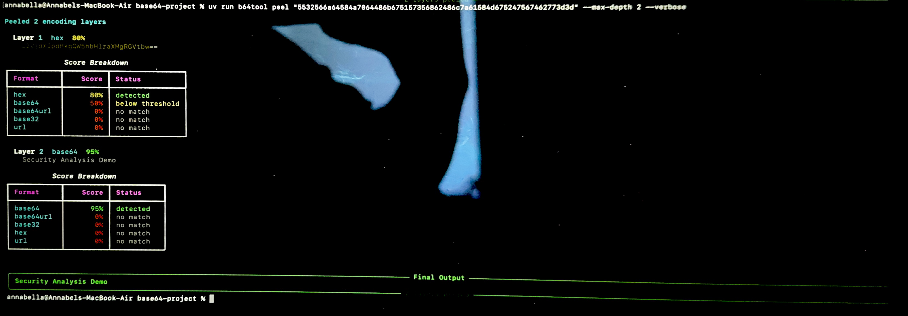

# Base64 Security Analysis Tool — Demo

This page documents hands-on testing of the encoding, decoding, detection, and recursive layer-analysis features of the tool.

## Installation

```bash
uv tool install base64tool
```

---

## Encoding

```bash
base64tool encode "Hello World"
```

Output:

```text
SGVsbG8gV29ybGQ=
```

---

## Decoding

```bash
base64tool decode "SGVsbG8gV29ybGQ="
```

Output:

```text
Hello World
```

---

## Recursive Layer Detection

```bash
base64tool peel "VTBkV2JH..."
```

Output:

```text
Layer 1: Base64
Layer 2: URL encoding
Layer 3: Plain text
```


The screenshots below demonstrate the tool running directly from my terminal.

---

## 1. Base64 — Encode, Decode & Detect

I tested the standard Base64 workflow by encoding plaintext, decoding the generated value, and running automatic format detection.



**Result:** The tool successfully encoded the plaintext, restored the original value during decoding, and identified the encoded input as Base64 with a confidence score.

---

## 2. Hex — Encode, Decode & Detect

I tested hexadecimal encoding to confirm that the tool could convert plaintext into hexadecimal representation and correctly reverse the process.



**Result:** The tool successfully encoded the plaintext into hexadecimal, decoded it back to its original value, and detected the Hex format.

---

## 3. Base32 — Encode, Decode & Detect

I tested Base32 encoding and decoding, followed by automatic detection of the encoded value.



**Result:** The tool successfully processed Base32 data and identified the encoding format using confidence-based detection.

---

## 4. Base64URL — Encode & Decode

I tested Base64URL encoding, which provides a URL-safe variation of standard Base64.



**Result:** The tool successfully encoded and decoded Base64URL data while preserving the original plaintext.

---

## 5. URL Encoding — Encode & Decode

I tested URL encoding to demonstrate how characters can be transformed into a format suitable for transmission within URLs.



**Result:** The tool successfully encoded the input into URL-encoded format and decoded it back to the original plaintext.

---

## 6. Recursive Layer Peeling

I created multiple encoding layers and tested the tool's recursive peeling capability.



**Result:** The tool analysed the encoded input layer by layer, identified the encoding formats and progressively decoded the data.

This demonstrates a security-analysis use case where multiple encoding layers may be used to obscure the underlying content.

---

## 7. Verbose Detection & Confidence Analysis

Finally, I tested verbose detection to inspect how the tool evaluates possible encoding formats.



**Result:** The verbose output displays the detection scores considered at each layer, providing visibility into how the tool determines the most likely encoding format.

---

## What This Demonstrates

Through this testing, I demonstrated:

- Multi-format encoding and decoding
- Base64, Base32, Hex, Base64URL and URL encoding
- Automatic encoding-format detection
- Confidence-based format analysis
- Multi-layer encoding
- Recursive layer peeling
- Verbose detection and score analysis
- Command-line security tooling and testing

These capabilities demonstrate how encoding can be analysed during cybersecurity investigations where suspicious data may be encoded or layered to make its underlying content less immediately visible.
