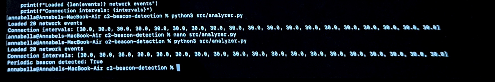
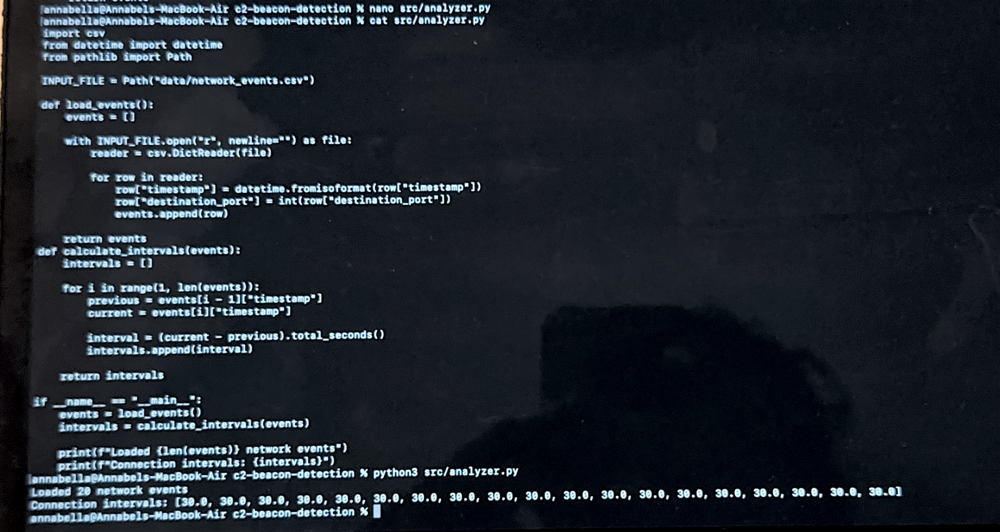
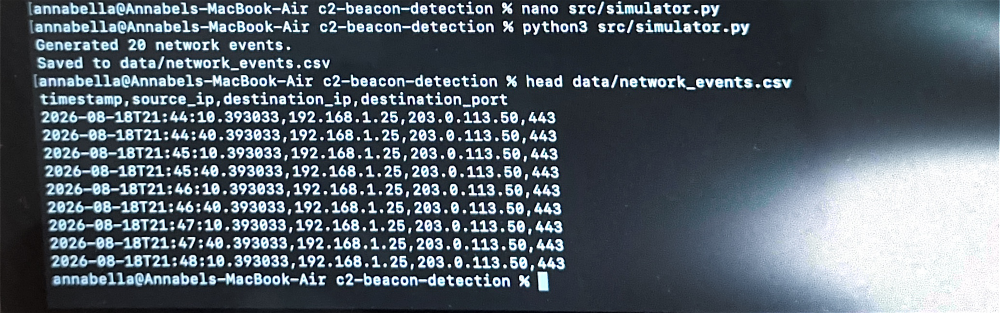
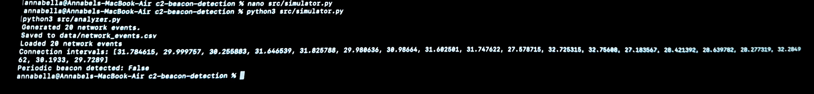

```ruby
 ██████╗██████╗     ██████╗ ███████╗ █████╗  ██████╗ ██████╗ ███╗   ██╗
██╔════╝╚════██╗    ██╔══██╗██╔════╝██╔══██╗██╔════╝██╔═══██╗████╗  ██║
██║      █████╔╝    ██████╔╝█████╗  ███████║██║     ██║   ██║██╔██╗ ██║
██║     ██╔═══╝     ██╔══██╗██╔══╝  ██╔══██║██║     ██║   ██║██║╚██╗██║
╚██████╗███████╗    ██████╔╝███████╗██║  ██║╚██████╗╚██████╔╝██║ ╚████║
 ╚═════╝╚══════╝    ╚═════╝ ╚══════╝╚═╝  ╚═╝ ╚═════╝ ╚═════╝ ╚═╝  ╚═══╝
```

```ruby
         ╔══════════════════════════════════════════════════════════════╗
         ║                     C2 BEACON DETECTOR                      ║
         ║                                                              ║
         ║              Detect • Analyse • Investigate                 ║
         ║                                                              ║
         ║                     CYBERSECURITY PROJECT                   ║
         ╚══════════════════════════════════════════════════════════════╝

                              GitHub: YemisiCreates
```
[](https://github.com/YemisiCreates/My-Cybersecurity-Portfolio/tree/main/beginner/c2-beacon-detection) [](https://www.python.org) [](https://attack.mitre.org/tactics/TA0011/)   
> A defensive cybersecurity project for detecting and analysing periodic Command-and-Control (C2) beaconing behaviour in simulated network traffic.

**This is a project overview — detection logic, analysis, evidence, and technical walkthroughs are documented below.**


## Overview

The C2 Beacon Detector is a Python-based defensive network-analysis project designed to identify periodic outbound communication patterns that may indicate Command-and-Control (C2) beaconing.

The project generates synthetic network telemetry and analyses connection timing to identify recurring communication patterns. It also introduces jitter to demonstrate how timing variation can affect detection accuracy and produce false negatives when detection thresholds are too strict.

The project focuses on behavioural detection rather than relying solely on known malicious IP addresses, domains, or signatures.


### Detection Flow

`Simulated Traffic → Network Events → Interval Analysis → Periodicity Check → Detection Result`

Example:

```ruby
Source:       192.168.1.25
Destination:  203.0.113.50
Port:         443

30 sec → 30 sec → 30 sec → 30 sec
                         ↓
              Periodic pattern identified
                         ↓
          Periodic beacon detected: True
```


## How It Works

The project follows a simple detection pipeline:

1. **Traffic Simulation**  
   `simulator.py` generates synthetic outbound network connections representing C2-style beacon traffic.

2. **Telemetry Generation**  
   Each event contains a timestamp, source IP, destination IP, and destination port.

3. **Interval Analysis**  
   `analyzer.py` calculates the time difference between consecutive network connections.

4. **Periodicity Detection**  
   The detector compares the connection intervals to determine whether communication is occurring at a consistent pattern.

5. **Jitter Testing**  
   Random timing variation is introduced to simulate more realistic beacon behaviour and test whether the detector can still identify the pattern.

6. **Detection Result**  
   The analyzer returns a result such as:

```text
Periodic beacon detected: True
```


## Detection Evidence

### 1. Periodic Beacon Detection



**Analyst observation:**  
The detector identified repeated network connections occurring at consistent intervals, resulting in `Periodic beacon detected: True`.

**Security Relevance:**  

Consistent outbound communication intervals can be an indicator of automated C2 beaconing. In a real SOC investigation, this behaviour would warrant further analysis of the source host, destination IP, process activity, DNS activity, and surrounding network telemetry.

---

### 2. Connection Interval Analysis



**Analyst Observation:**  

The connection timestamps were converted into intervals between consecutive network events. Similar intervals indicate that the communication is occurring on a predictable schedule.

**Security Relevance:**  

Interval analysis helps analysts distinguish potentially automated beaconing behaviour from less predictable user-generated network traffic.

---

### 3. Simulated Network Events



**Analyst Observation:**  

Synthetic network telemetry was generated to provide a safe dataset containing repeated outbound connection events for analysis.

**Security Relevance:**  

Using synthetic telemetry allows detection logic to be developed and tested in a controlled environment without generating real malicious C2 traffic.

---

### 4. Jittered Traffic — No Beacon Detected



**Analyst Observation:**  

Timing variation (jitter) was introduced between network connections. The additional variation caused the communication pattern to fall outside the detector's configured tolerance.


**Security Relevance:**  

This demonstrates an important detection-engineering limitation: overly strict thresholds can miss beacon-like behaviour when communication intervals vary, creating a potential **false negative**.

The detection tolerance can therefore be adjusted to balance:

`Detection Sensitivity ↔ False Positives ↔ False Negatives'


## Detection Engineering Analysis

The testing demonstrated that periodicity can be useful for identifying beacon-like network behaviour, but detection accuracy depends heavily on the configured timing tolerance.

A strict tolerance successfully identifies highly regular communication but may fail when jitter is introduced, increasing the risk of false negatives. Increasing the tolerance may improve detection of jittered beaconing but can also increase false positives from legitimate periodic traffic.

This creates an important detection-engineering trade-off:

`Higher Sensitivity ↔ More False Positives`

`Lower Sensitivity ↔ More False Negatives`

For this reason, periodicity should be treated as one behavioural signal rather than standalone proof of malicious C2 activity.


## MITRE ATT&CK Mapping

This project demonstrates detection concepts associated with the **Command and Control (C2)** stage of adversary activity.

| ATT&CK | Mapping | Relevance to This Project |
|---|---|---|
| **TA0011** | Command and Control | The project analyses repeated outbound network communication that may indicate C2 beaconing behaviour. |
| **T1071** | Application Layer Protocol | The detection methodology focuses on identifying suspicious recurring communication patterns that may be associated with application-layer C2 traffic. |


### Detection Perspective

Rather than relying solely on known malicious IP addresses or signatures, this project uses **behaviour-based detection**.

The detector examines:

- repeated outbound connections
- source and destination relationships
- connection timestamps
- communication intervals
- periodicity
- timing variation (jitter)

This demonstrates how suspicious beacon-like behaviour can be identified using communication patterns even when a known malicious indicator is not available.

> **Analyst Note:** Periodic communication alone does not confirm malicious C2 activity. In a real SOC environment, an alert would require additional investigation and correlation with endpoint, DNS, process, authentication, and other network telemetry.


## SOC Investigation Workflow

A periodic beacon detection should be treated as a **starting point for investigation**, not immediate confirmation of compromise.

If this detection generated an alert in a SOC environment, I would follow the investigation process below:

### 1. Triage the Alert

Review the detection details to understand:

- Source IP / affected host
- Destination IP
- Destination port
- Connection frequency
- Number of repeated connections
- Time period over which the activity occurred
- Detection confidence and configured tolerance

**Goal:** Determine what triggered the alert and whether the behaviour warrants further investigation.

### 2. Validate the Network Activity

Examine additional network telemetry such as:

- Firewall logs
- Proxy logs
- DNS queries
- NetFlow/network flow data
- IDS/IPS alerts

Check whether the destination is expected for the affected system and whether similar communication occurs elsewhere in the environment.

### 3. Enrich the Destination

Investigate the destination IP or domain using available threat-intelligence sources.

Look for:

- Reputation
- Previous malicious activity
- Domain age
- Related indicators of compromise (IOCs)
- Known malware or C2 infrastructure associations

A clean reputation would **not automatically make the activity benign**, particularly when behavioural evidence remains suspicious.

### 4. Correlate With Endpoint Activity

Review EDR or endpoint telemetry from the source host.

Investigate:

- Which process initiated the connection?
- Is the process expected?
- What user account executed it?
- Are there suspicious parent/child process relationships?
- Are there persistence mechanisms?
- Are there unusual files or command-line activity?

This helps connect the **network behaviour** to activity occurring on the endpoint.

### 5. Scope the Activity

Determine whether the behaviour affects only one host or multiple systems.

Search for:

- Other hosts contacting the same destination
- Similar beacon intervals
- Related domains or IP addresses
- Similar endpoint processes
- Additional alerts associated with the same host or user

### 6. Determine the Disposition

Based on the collected evidence, classify the alert appropriately.

Possible outcomes include:

- **True Positive** — malicious C2 activity is supported by additional evidence.
- **False Positive** — legitimate software or expected network behaviour explains the periodic communication.
- **Suspicious / Inconclusive** — additional investigation or escalation is required.

### 7. Respond and Document

If malicious activity is confirmed, follow the organisation's incident-response procedures, which may include host isolation, blocking malicious infrastructure, preserving evidence, and escalation.

Document:

- Detection details
- Investigation queries
- Evidence reviewed
- Timeline
- Indicators discovered
- Analyst assessment
- Actions taken
- Final disposition

> **SOC Analyst Principle:** A beacon detection is an indicator for investigation. Periodicity provides behavioural evidence, but additional network and endpoint context is required before determining that Command-and-Control activity has occurred.


## Skills Demonstrated

- Network traffic analysis
- C2 beacon detection
- Python security automation
- Detection engineering
- Behaviour-based threat detection
- Security event investigation
- MITRE ATT&CK mapping
- SOC alert triage methodology
- Linux/macOS command-line usage
- Git and GitHub version control
- Technical cybersecurity documentation


## Ethical Use

This project was developed strictly for educational and defensive cybersecurity purposes in a controlled local lab environment.


