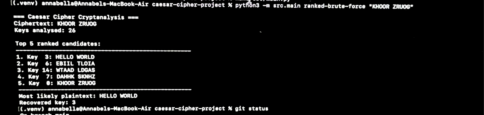
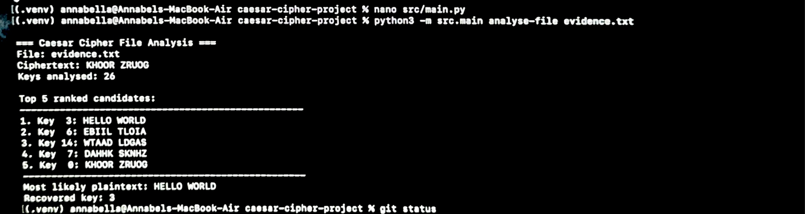
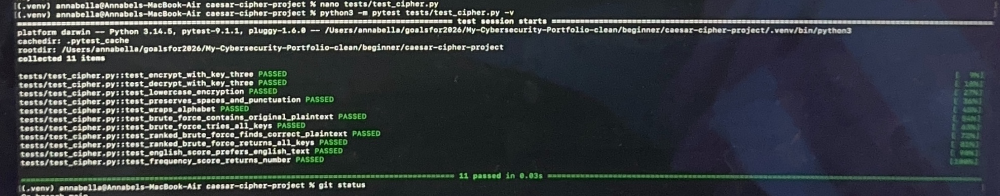

```ruby
 ██████╗ █████╗ ███████╗███████╗ █████╗ ██████╗      ██████╗██╗██████╗ ██╗  ██╗███████╗██████╗ 
██╔════╝██╔══██╗██╔════╝██╔════╝██╔══██╗██╔══██╗    ██╔════╝██║██╔══██╗██║  ██║██╔════╝██╔══██╗
██║     ███████║█████╗  ███████╗███████║██████╔╝    ██║     ██║██████╔╝███████║█████╗  ██████╔╝
██║     ██╔══██║██╔══╝  ╚════██║██╔══██║██╔══██╗    ██║     ██║██╔═══╝ ██╔══██║██╔══╝  ██╔══██╗
╚██████╗██║  ██║███████╗███████║██║  ██║██║  ██║    ╚██████╗██║██║     ██║  ██║███████╗██║  ██║
 ╚═════╝╚═╝  ╚═╝╚══════╝╚══════╝╚═╝  ╚═╝╚═╝  ╚═╝     ╚═════╝╚═╝╚═╝     ╚═╝  ╚═╝╚══════╝╚═╝  ╚═╝
```

```ruby
                     ╔══════════════════════════════════════════════════════════════╗
                     ║              CAESAR CIPHER SECURITY ANALYSIS                ║
                     ║                                                              ║
                     ║             Encrypt • Decrypt • Crack • Analyse             ║
                     ║                                                              ║
                     ║                     CYBERSECURITY PROJECT                    ║
                     ╚══════════════════════════════════════════════════════════════╝

                                      GitHub: Oluwayemisi-Teluwo
```

[](https://github.com/YemisiCreates/My-Cybersecurity-Portfolio/tree/main/beginner/caesar-cipher-project)
[](https://www.python.org)
[](#testing)
[](#security-analysis)

> **A Python cybersecurity project for encrypting, decrypting, brute-force cracking and analysing Caesar Cipher ciphertext using English-likelihood and letter-frequency analysis.**


## Project Overview

This project explores classical cryptography through the implementation and analysis of the Caesar cipher using Python.

I built a command-line tool that can encrypt and decrypt text, test every possible Caesar cipher key through brute-force analysis, and rank possible plaintext results to help identify the most likely original message.

The project helped me develop a practical understanding of encryption, cryptanalysis, brute-force attacks, keyspaces, Python testing, command-line tools, and Git/GitHub workflow.

---

## Screenshots & Demo

### Ranked Brute-Force Analysis



### File-Based Ciphertext Analysis



### Automated Testing



---

## Cybersecurity Concepts Demonstrated

### Encryption and Decryption

A Caesar cipher is a substitution cipher where each letter in plaintext is shifted by a fixed number of positions in the alphabet.

For example, using a key of `3`:

```text
HELLO WORLD
↓
KHOOR ZRUOG
```

Decrypting with the same key reverses the shift:

```text
KHOOR ZRUOG
↓
HELLO WORLD
```

---

### Keyspace

The Caesar cipher has only 26 possible shifts.

Because the keyspace is extremely small, an attacker does not need to know the encryption key beforehand. Every possible key can simply be tested.

This demonstrates why keyspace size is an important consideration when evaluating the strength of an encryption algorithm.

---

### Brute-Force Analysis

The tool can attempt all 26 possible Caesar cipher keys against ciphertext.

Example:

```bash
python3 -m src.main brute-force "KHOOR ZRUOG"
```

The program produces every possible plaintext candidate:

```text
Key  0: KHOOR ZRUOG
Key  1: JGNNQ YQTNF
Key  2: IFMMP XPSME
Key  3: HELLO WORLD
...
```

This demonstrates a basic brute-force cryptanalysis technique.

---

### Ranked Brute-Force Analysis

```bash
python3 -m src.main ranked-brute-force "KHOOR ZRUOG"
```
### Analyse File

Analyse cipher text stored in a file:

```bash
python3 -m src.main analyse-file EVIDENCE.TXT
```

The tool reads the cipher text from the file, tests all 26 possible Caesar cipher keys, ranks the candidates, and reports the most likely plaintext and recovered key.

Example output:

```text
Most likely plaintext candidates:

Key  3: HELLO WORLD
Key  6: EBIIL TLOIA
Key 14: WTAAD LDGAS
...
```

This demonstrates how analysis can be added to raw brute-force results to help prioritise likely findings.

---

## Command-Line Interface

The project includes a CLI built with Python's `argparse`.

Available commands:

```text
encrypt
decrypt
brute-force
ranked-brute-force
analyse-file
```

### Encrypt

```bash
python3 -m src.main encrypt "HELLO WORLD" --key 3
```

Output:

```text
KHOOR ZRUOG
```

### Decrypt

```bash
python3 -m src.main decrypt "KHOOR ZRUOG" --key 3
```

Output:

```text
HELLO WORLD
```

### Brute Force

```bash
python3 -m src.main brute-force "KHOOR ZRUOG"
```

### Ranked Brute Force

```bash
python3 -m src.main ranked-brute-force "KHOOR ZRUOG"
```

---

## Testing

I used `pytest` to test the behaviour of the cipher and analysis functions.

The test suite checks:

- Encryption with a known key
- Decryption with a known key
- Lowercase encryption
- Preservation of spaces and punctuation
- Alphabet wrap-around
- Brute-force recovery of the original plaintext
- Testing of all possible Caesar cipher keys
- Ranked brute-force identification of likely plaintext
- Ranked brute-force coverage of all keys

Current result:

```text
11 passed
```

---

## Tools Used

- Python
- pytest
- argparse
- uv / virtual environments
- Terminal (zsh)
- Git
- GitHub
- Nano

---

## Project Structure

```text
caesar-cipher-project/
├── src/
│   ├── analysis.py
│   ├── cipher.py
│   └── main.py
├── tests/
│   └── test_cipher.py
├── EVIDENCE.TXT
├── file-analysis.png
├── ranked-bruteforce.png
├── tests-passed.png
├── .gitignore
└── README.md
```

---

## Security Analysis

The Caesar cipher is not suitable for protecting modern sensitive information.

Its major weakness is its extremely small keyspace. Since there are only 26 possible shifts, an attacker can test every key very quickly.

This project demonstrates an important cybersecurity principle:

> Encryption is not automatically secure simply because information has been transformed into unreadable ciphertext.

The strength of an encryption system depends on factors such as the algorithm, keyspace, key management, and resistance to cryptanalysis.

---

## What I Learned

Through this project, I practised:

- Implementing encryption and decryption logic in Python
- Understanding plaintext, ciphertext, keys, and keyspaces
- Performing brute-force cryptanalysis
- Analysing and ranking possible plaintext results
- Building a command-line security tool
- Writing automated tests with pytest
- Debugging Python syntax, import, indentation, and environment issues
- Using virtual environments
- Using Git for version control
- Maintaining a cleaner repository with `.gitignore`
- Documenting a cybersecurity project for GitHub

---

## Ethical Use

This project was developed strictly for educational and ethical cybersecurity purposes.

The techniques demonstrated, including brute-force analysis and cryptanalysis, are intended to help me understand how encryption mechanisms can be evaluated and why weak cryptographic methods can be vulnerable to attack.

All testing was performed within my own controlled environment. These techniques should only be used on systems, data, or environments where explicit permission has been granted.

The Caesar cipher is a historical encryption technique and should not be used to protect sensitive or confidential information.
